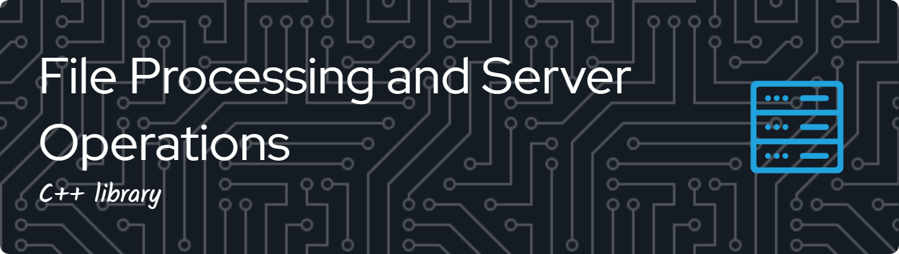

## Overview
This modular C++ library is designed for high-performance file processing and server operations. It has been built with a test‐driven approach to ensure robust performance and seamless integration. The library is created with future expansion in mind, allowing additional components to be added as needs evolve. The core modules are focused on file compression and server-related operations such as authentication, encryption, and password management.

## Modules Overview
- **File Compression (v0.1, Under Development):**  
  A functional module to compress an array (or blob) of files into one archive.  
  *Features include:*
    - Automatic selection of compatible compression methods (e.g., H.264 for video, JPEG for images).
    - Default lossless LZMA compression if no algorithm is specified.
    - JSON-based input with options for encryption (currently a placeholder).
    - Aggregated file handling with pre-compression options for single files.
    - Integrated checksum verification and sealing/audit logging.
    - Extensive error handling with warnings, errors, and progress info.
- **Authentication Module (Planned):**  
  Secure login and registration support.
- **Encryption Module (Planned):**  
  Multiple encryption types with an easy-to-extend plugin system.
- **Password Manager / Hash Manager (Planned):**  
  Tools for secure password storage and retrieval.
- **Error Handler Component (Planned):**  
  A centralized component for managing logging and error propagation across all modules.
- **Additional Future Components:**  
  For example, network security modules, advanced data serialization, and dynamic plugin installers.

## Architecture Diagram
Below is a sample Mermaid diagram illustrating the high-level architecture:

```mermaid
flowchart TD
    A[Server Startup] --> B[Receive File Blob/JSON]
    B --> C{File Count?}
    C -- Single File --> D[Apply Single File Compression Options]
    C -- Multiple Files --> E[Aggregate Files & Global Compression]
    D --> F[Select Compatible Compression (Default: LZMA)]
    E --> F
    F --> G[Perform Checksum & Seal Verification]
    G --> H[Return Compressed Archive and Log Details]
```

## Future Improvements
- **Stream-Based Compression:**  
  Adding support for real-time, chunked compression.
- **Configurable Logging & Error Handling:**  
  A dedicated error handling module to centralize logs and error codes.
- **Enhanced Authentication & Encryption:**  
  Secure components for login, encryption, and password hashing.
- **Dynamic Plugin Installer:**  
  The ability to download and register new compression algorithms as plugins.
- **Network Security and File Transfer Protocols:**  
  Enhancing secure communication between system components.

## License
This project is licensed under the Apache License 2.0.
