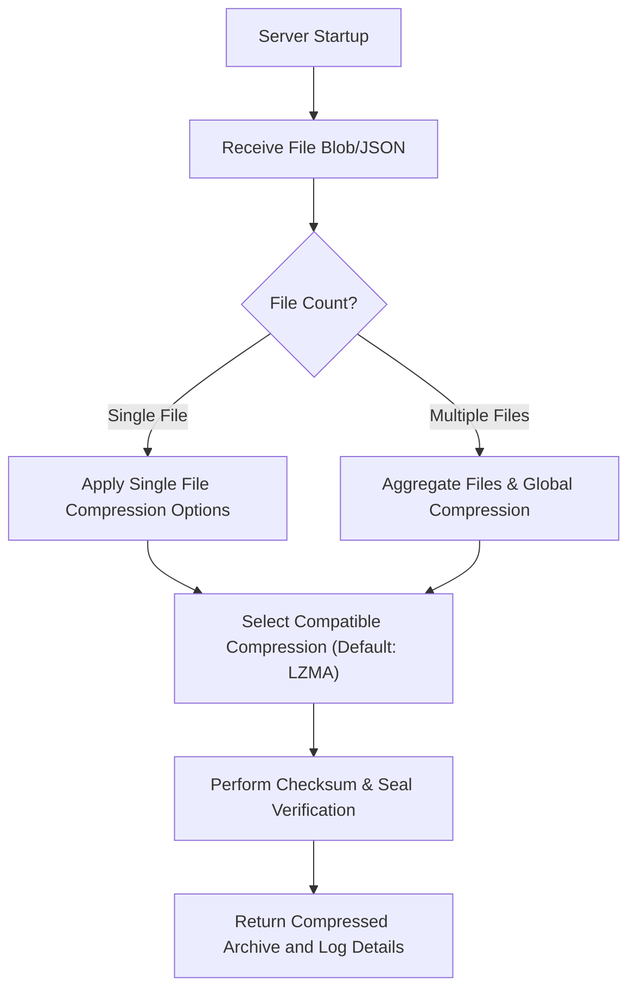

# File Compression (v0.1)

## Overview
This standalone, functional module compresses an array (or blob) of files provided as a JSON document. If no compression method is specified, the system defaults to lossless LZMA. Users can select compatible methods based on file type—for example, H.264 for videos and JPEG for images. There is an option to pre-compress individual files using additional (future) parameters; details on these parameters will be added later. If the JSON sets the encryption flag to true, an informative message ("Encryption is not yet implemented") is returned.

## Architecture Diagram
Below is a sample Mermaid diagram illustrating the high-level architecture:



## JSON / Blob Specification

### Purpose
The JSON structure serializes an array of files along with compression options. This structure is fixed now but is designed to be extended later to support additional settings or alternative data formats.

### Required Fields for Each File
- **fileName** – Name of the file.
- **fileType** – The file extension (e.g., "txt", "mp4", "jpg").
- **fileData** – Base64-encoded content of the file.
- **lastModified** – The file's last modification date.
- **creationDate** – The file's creation date.

### Options Object
- **compressionAlgorithm** – Compression method to use. Valid values are "LZMA" (default if missing), "zip", "H.264", "JPEG", and "fast" (fastest available based on time benchmarks).
- **mode** – "lossless" or "lossy". If set to "lossy", a confirmation must be provided.
- **preCompress** – An object specifying pre-compression options for specific file types. For example:
    - `video`: `{ "compressionId": "H.264", "quality": 75 }`
    - `image`: `{ "compressionId": "JPEG", "quality": 80 }`
    - `text`: `null`
- **encryption** – Boolean; if `true`, an informative message "Encryption is not yet implemented" is returned.

### Example JSON Structure:
```json
{
  "files": [
    {
      "fileName": "video.mp4",
      "fileType": "mp4",
      "fileData": "Base64EncodedData...",
      "lastModified": "2023-10-10T15:30:00Z",
      "creationDate": "2023-09-01T12:00:00Z"
    },
    {
      "fileName": "image.jpg",
      "fileType": "jpg",
      "fileData": "Base64EncodedData...",
      "lastModified": "2023-10-08T10:20:00Z",
      "creationDate": "2023-08-15T08:00:00Z"
    }
  ],
  "options": {
    "compressionAlgorithm": "LZMA",
    "mode": "lossless",
    "preCompress": {
      "video": {"compressionId": "H.264", "quality": 75},
      "image": {"compressionId": "JPEG", "quality": 80},
      "text": null
    },
    "encryption": false
  }
}
```

## Functional Workflow
1. **Input Parsing:**  
   The API processes the entire JSON, validating file attributes (including metadata) and global options.
2. **Error Handling:**  
   All errors and warnings are reported using a unified error handler. Unsupported file types trigger automatic notifications; a complete error report is generated and then relayed to the user.
3. **Compression Processing:**  
   - **Single File:** Additional (future) parameters may apply (e.g., quality settings for videos).
   - **Multiple Files:** Files are aggregated into one archive after optional individual pre-compression.
4. **Checksum and Seal Verification:**  
   Each compressed file is validated via checksum verification and “sealed” with an audit log entry for later integrity checks.

## Testing Strategy

Testing for this module is implemented using Google Test. Note that only tests for the current functionality are included; future improvements will have their own tests.

### 1. Unit Tests
- **Objective:**  
  Validate individual functions, including JSON parsing, algorithm selection, and proper error code returns.
- **Focus:**  
  - Verify default behavior (lossless LZMA is used when no algorithm is specified).
  - Test handling of invalid JSON or unsupported file types.
- **Example Unit Test:**
```cpp
#include <gtest/gtest.h>
#include "CompressionAPI.h"

TEST(CompressionAPITest, DefaultAlgorithmUsed) {
    std::string jsonInput = R"({
      "files": [
          {
              "fileName": "doc.txt",
              "fileType": "txt",
              "fileData": "Base64EncodedData...",
              "lastModified": "2023-10-10T15:30:00Z",
              "creationDate": "2023-09-01T12:00:00Z"
          }
      ],
      "options": {
          "mode": "lossless",
          "preCompress": {"text": null},
          "encryption": false
      }
    })";
    auto result = CompressionAPI::compressBlob(jsonInput);
    EXPECT_EQ(result.errorCode, CompressionAPI::ErrorCode::SUCCESS);
    // Assert that LZMA was chosen as the default.
}
``` 

### 2. System Tests
- **Objective:**  
  Validate the end-to-end process from JSON input to compressed output.
- **Focus:**  
  - Test complete workflows with proper metadata processing.
  - Generate test files with specific sizes (ranging between 25MB and 100MB, 250MB, 5GB, and 15GB) and run each test case multiple times to verify compression ratios.
- **Test Data Generation Example:**  
  Use the following C++ function to generate test files including metadata:
```cpp
#include <fstream>
#include <chrono>
#include <ctime>
#include <random>

void generateTestFile(const std::string& fileName, size_t fileSizeInMB) {
    std::ofstream file(fileName, std::ios::binary);
    std::vector<char> data(1024 * 1024); // 1MB buffer
    std::default_random_engine eng(static_cast<unsigned>(std::chrono::system_clock::now().time_since_epoch().count()));
    std::uniform_int_distribution<char> dist(0, 255);

    for (size_t i = 0; i < fileSizeInMB; ++i) {
        for (auto &byte : data) {
            byte = dist(eng);
        }
        file.write(data.data(), data.size());
    }
    file.close();
    // Metadata (lastModified and creationDate) can be set or verified using platform-specific APIs.
}
```

### 3. Application Tests
- **Objective:**  
  Simulate real-world usage by integrating the compression process within a sample application.
- **Focus:**  
  - Confirm that only compatible compression methods are shown in the download wizard.
  - Verify error reporting (e.g., unsupported file types, encryption flag issues) and that informational codes are logged for key actions.
- **Note:**  
  Future GUI tests (e.g., using Playwright) will evaluate the end-to-end user interface.

### 4. Informational and Audit Logging Tests
- **Objective:**  
  Ensure that the system logs important operational codes and audit information.
- **Focus:**  
  - Validate that each key action logs an informational code (e.g., i1, i2) and that only the last 100 entries are retained.
  - Confirm that the audit log correctly tracks "sealing" operations.

### Current implemented tests

- **JSON Parsing:**
    - Valid JSON returns `SUCCESS`.
    - Empty/malformed JSON returns error `EU1`.

- **Compression Algorithm Selection:**
    - Specific algorithm (e.g., "LZMA") returns `SUCCESS`.
    - No algorithm specified defaults to LZMA → `SUCCESS`.
    - Unsupported file type returns error `EU2`.

- **Precompression Parameters:**
    - Valid parameters return `SUCCESS`.
    - Missing/invalid parameters trigger warning `WU1`.

- **File Metadata Handling:**
    - Correct metadata (lastModified, creationDate) returns `SUCCESS`.
    - Missing metadata triggers a warning.

- **Compression Functionality:**
    - `compressBlob` returns a compressed file with `SUCCESS`.
    - Individual methods (LZMA, ZIP, H.264, JPEG) tested separately.
    - Compression ratio test: Run each file size (1MB, 50MB, 100MB, 1GB, 5GB, 15GB) 5 times; average ratio must be below expected threshold.

- **Decompression Functionality:**
    - `decompressBlob` returns decompressed data with `SUCCESS`.
    - Corrupted input returns error `ES3`.
    - Data integrity issues return error `ES4`.

- **Checksum & Data Integrity:**
    - Simulated checksum mismatch returns error `ES2`.
    - Correct checksum returns `SUCCESS`.

- **Encryption Flag:**
    - Encryption requested returns warning `WU2` (or `SUCCESS` if implemented).


## Error Code Overview (Compression Specific)
| **Code** | **Type**   | **Location** | **Description**                                                        |
|----------|------------|--------------|------------------------------------------------------------------------|
| **0**    | Success    | -            | Operation succeeded.                                                   |
| **w1**   | Warning    | u/s/n        | Minor issue detected (e.g., non-critical data mismatch).               |
| **w2**   | Warning    | u/s/n        | Deprecated parameter used.                                             |
| **eu1**  | Error      | u            | User error: Permission denied on file upload.                          |
| **eu2**  | Error      | u            | User error: Invalid JSON format.                                       |
| **es1**  | Error      | s            | Server error: Compression failure during processing.                   |
| **es2**  | Error      | s            | Server error: Checksum or seal verification failure.                   |
| **en1**  | Error      | n            | Network error: Communication failure not attributed to user or server. |
| **ee1**  | Error      | s            | Encryption error (if encryption were enabled).                         |

---

## License
Licensed under Apache License 2.0.

